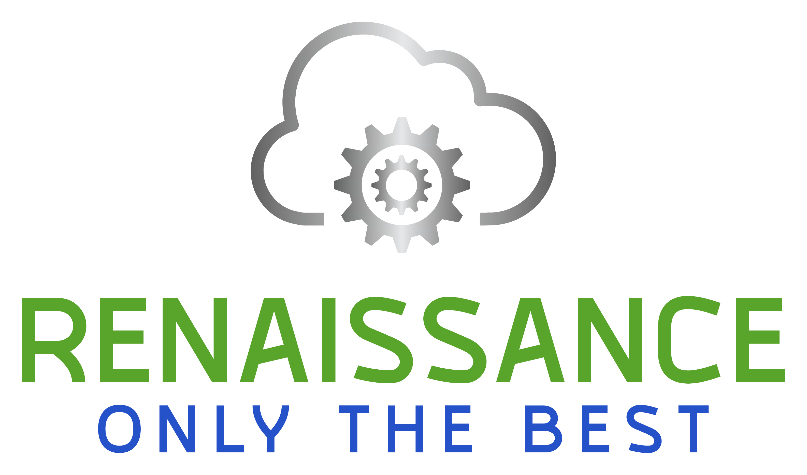

#  Enterprise Software & Data Engineering

### [📤 Email Me](mailto:ehchampagne@gmail.com)

### 🚀 High-Performance Solutions for Telecom, Insurance & Healthcare

I am a veteran Principal Software and Data Engineer and the founder of **Renni-Tech**. We specialize in modernizing legacy infrastructure, optimizing mission-critical data processes, and building high-throughput, low-latency distributed systems. 

With over a decade of deep expertise in the **.NET ecosystem** and **SQL Server**, we engineer resilient software architectures designed to handle millions of concurrent transactions, comply with strict reporting standards, and heavy data loads.

---

### 🎯 Core Capabilities & Industry Focus 

#### 🏦 Insurance Tech
* **Claims Reporting:** Automated and event-driven architectures handling complex rule engines and real-time validations.

#### 📞 Telecommunications 
* **Distributed Billing Engines:** Migration, automation and upgrade of distributed legacy billing system.
* **Legacy Modernization:** Migrating monolithic .NET Framework 4.x apps to cloud-native .NET 6 - 8 microservices.

#### 🏥 Healthcare 
* **Automated Referral Worflows:** Automated and integrated referrals into a central phone/SMS platform.
* **Payment APIs:** Created payment, and corresponding auditing/reporting workflows using Stripe APIs
---

### 🛠️ Technical Arsenal

* **Languages & Frameworks:** .NET 8/9, C#, ASP.NET Core, Entity Framework Core.
* **Database & Data Services:** SQL Server (T-SQL, Index Tuning, Schema Design, Stored Procedures).
* **Cloud & DevOps:** Azure (App Services, Functions, Service Bus), AWS (EC2, RDS), GitHub Actions, CI/CD.
* **Architecture Patterns:** Domain-Driven Design (DDD), Test-Driven Development (TDD), Microservices, Clean Architecture, SOLID.

<!-- ---
todo: prepare some repos for the following:
### 🏗️ Featured Enterprise Repositories

* 🌐 **[Stripe Payment API](https://github.com)** - Production ready stripe payment solution.

* 🗄️ **[Claims Reporting](https://github.com)** - A collection of different types of insurance reports (inforce, bordereau(aka BDX), class code, etc)

* 🔄 **[Distributed Billing](https://github.com)** - Example of how to use billing system. 

* 🔄 **[Cloud Functions](https://github.com)** - Examples of how I might use Azure and AWS services. 
-->

---

### 💼 Work With Us

Do you have a slow SQL database costing you money, a legacy .NET codebase holding back your business agility or a vendor holding your business hostage? Let's fix it.

* **Services:** Architecture Assessments, Performance Audits, Dedicated Project Delivery, Technical Leadership.
* **Availability:** Now accepting enterprise consulting contracts.

<!-- todo link to Google form
👉 **[Click here to schedule a 30-minute technical evaluation](https://calendly.com)**

 -->